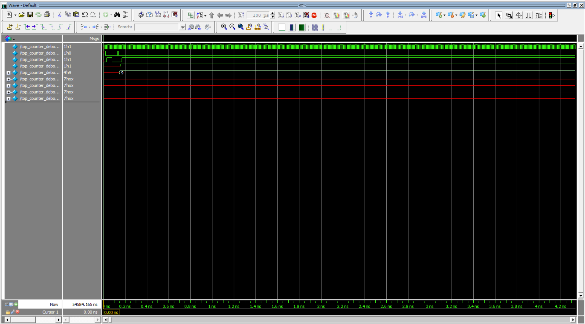
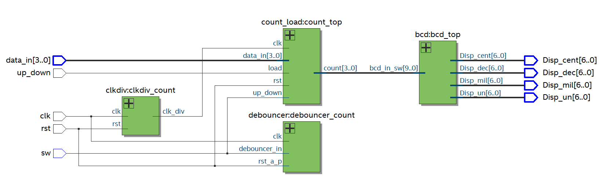
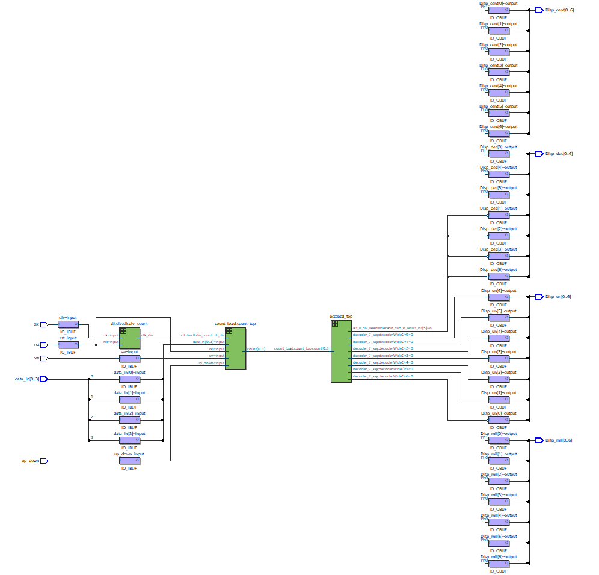

# Counter en Verilog

## Información del Autor
- **Nombre:** Ana Maria Rodriguez Peña
- **Matrícula:** A01741831

## Descripción
Este proyecto implementa un contador en Verilog, el cual utiliza un divisor de frecuencia, un eliminador de rebotes y un módulo de conversión a BCD para representar el conteo en un display de 7 segmentos. El diseño permite contar pulsos de entrada de manera estable y precisa, mostrando el resultado en unidades, decenas, centenas y millares. Es útil en aplicaciones digitales donde se requiere un conteo confiable y su visualización en dispositivos de salida.

## Requisitos
*	Quartus Prime (Intel FPGA)
*	FPGA compatible (DE10-Lite, MAX10 10M50DAF484C7G)
*	Cable de programación JTAG

## Estructura del Proyecto
*	  clkdiv.v: Genera una señal de reloj con menor frecuencia a partir de la señal original.
*   debouncer.v: Estabiliza la señal de entrada para evitar fluctuaciones indeseadas, compensando la mecánica de los interruptores.
*   count_load.v: Implementa un contador con funciones de carga (Load) y conteo ascendente/descendente (Up/Down), sincronizado con el reloj.
*   bcd.v: Convierte los valores en formato hexadecimal a su representación decimal en displays de 7 segmentos.
*   top_counter_debouncer_clkdiv.v: Módulo principal que integra y conecta todos los componentes mediante cables (wires).
*   top_counter_debouncer_clkdiv_tb.v: Banco de pruebas (testbench) que simula pulsaciones y verifica el correcto funcionamiento del sistema.

## Imágenes

## Video
[Ver video](ruta/al/Video_counter.mp4)
<video controls width="600">
  <source src="Video_counter.mp4" type="video/mp4">
  Tu navegador no soporta la reproducción de videos.
</video>
