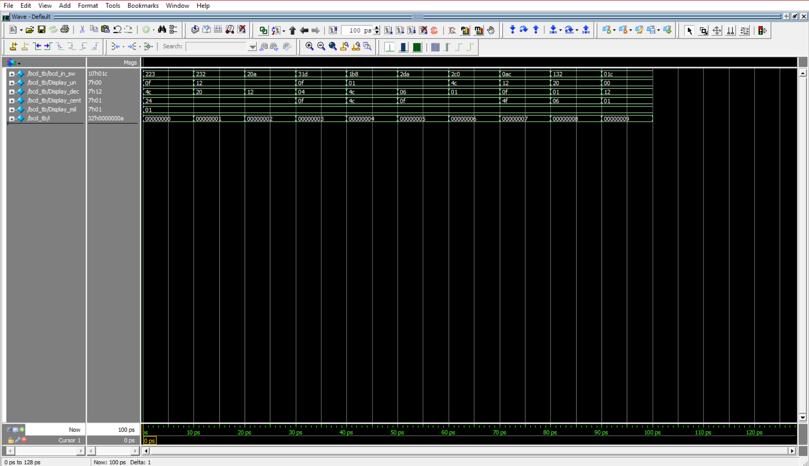
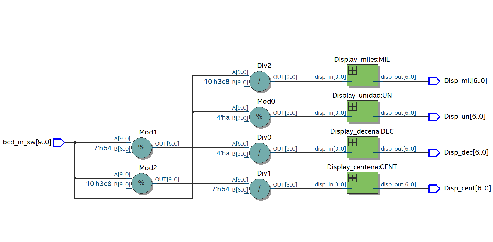
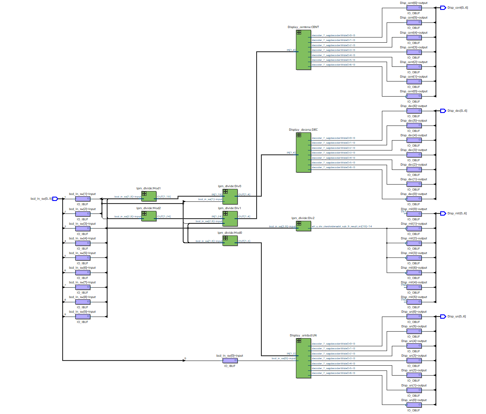

# Decodificación BCD en Verilog

## Información del Autor
- **Nombre:** Ana Maria Rodriguez Peña
- **Matrícula:** A01741831

## Descripción
Este proyecto implementa un decodificador BCD en Verilog, el cual convierte un número binario en su representación en código decimal codificado en binario (BCD). Este diseño es útil para la visualización de números en displays de 7 segmentos y otros dispositivos digitales.
## Imágenes

## Video
[Ver video](ruta/al/bcd_tarjeta.mp4)
<video controls width="600">
  <source src="bcd_tarjeta.mp4" type="video/mp4">
  Tu navegador no soporta la reproducción de videos.
</video>

## Archivos del Proyecto
- `bcd_decoder.v`: Código fuente en Verilog del decodificador BCD.
- `testbench.v`: Banco de pruebas para verificar el correcto funcionamiento del decodificador.
- `README.md`: Este archivo con la descripción del proyecto.
