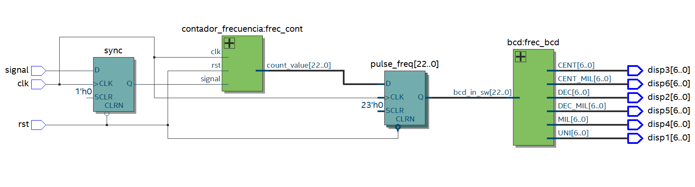

# Frecuenciometro en Verilog

## Información del Autor
- **Nombre:** Ana Maria Rodriguez Peña
- **Matrícula:** A01741831

## Descripción
Este proyecto implementa un medidor de frecuencia en Verilog, diseñado para medir la frecuencia de una señal de entrada y mostrarla en displays de 7 segmentos. El sistema consta de varios módulos que trabajan en conjunto para contar los flancos de subida de la señal en un período de tiempo definido (1 segundo), convertir el valor binario resultante en dígitos BCD (Decimal Codificado en Binario) y finalmente decodificar estos dígitos para su visualización en displays de 7 segmentos.

## Requisitos
*	Quartus Prime (Intel FPGA)
*	FPGA compatible (DE10-Lite, MAX10 10M50DAF484C7G)
*	Cable de programación JTAG

## Estructura del Proyecto
*	Entrada:
*     Una señal de entrada (signal) cuya frecuencia se desea medir.
*     Un reloj (clk) para sincronizar el sistema.
*     Una señal de reset (rst) para inicializar los contadores y registros.
*   Salida:
*     Seis señales (disp1, disp2, disp3, disp4, disp5, disp6) que representan los dígitos de la frecuencia medida en formato de 7 segmentos. Estos dígitos corresponden a las unidades, decenas, centenas, millares, decenas de millar y centenas de millar.
*   Proceso:
*     Conteo de Frecuencia:
*       El módulo contador_frecuencia cuenta los flancos de subida de la señal de entrada (signal) durante un intervalo de 1 segundo (equivalente a 50 millones de ciclos de reloj para un clk de 50 MHz). El valor resultante se almacena en un registro de 23 bits (count_value).
*     Sincronización de la Señal:
*       La señal de entrada (signal) se sincroniza con el reloj (clk) en el módulo frecuencimetro para evitar problemas de metaestabilidad.
*     Conversión a BCD:
*       El módulo bcd toma el valor binario de la frecuencia (pulse_freq) y lo separa en sus dígitos decimales usando operaciones de módulo y división. Cada dígito corresponde a un valor decimal (unidades, decenas, centenas, etc.).
*     Decodificación a 7 Segmentos:
*       Cada dígito BCD se envía a una instancia del módulo decoder_7_seg, que convierte el valor en una señal de 7 bits compatible con displays de 7 segmentos.
*     Visualización:
*       Las seis salidas (disp1 a disp6) se conectan a los displays de 7 segmentos para mostrar la frecuencia medida en formato decimal.

## Imágenes

## Video
<video controls width="600">
  <source src="Frecuenciometro.mp4" type="video/mp4">
  Tu navegador no soporta la reproducción de videos.
</video>
