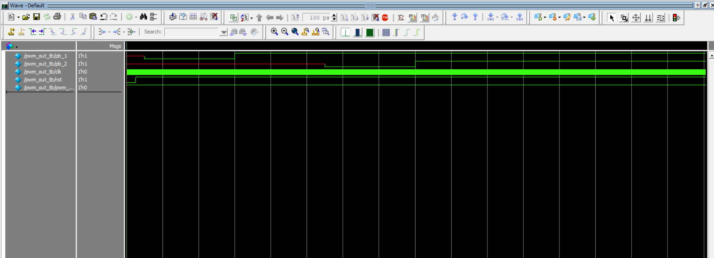
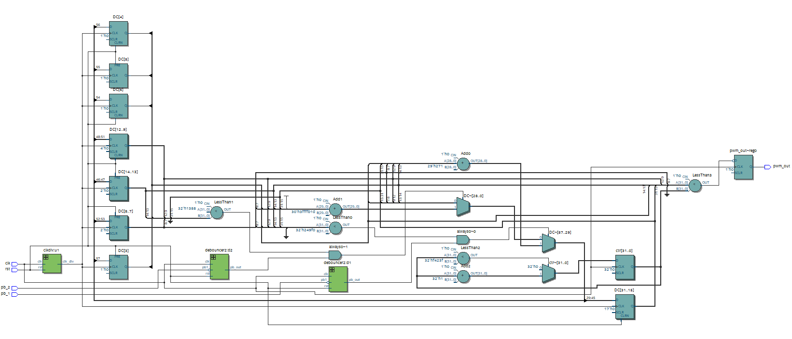
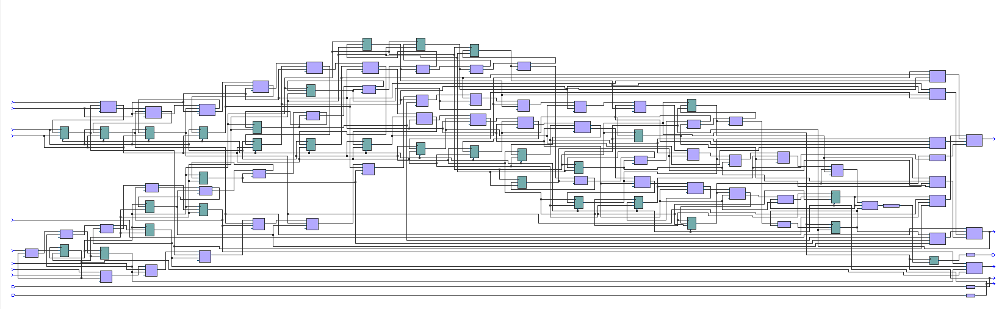

# PWM en Verilog

## Información del Autor
- **Nombre:** Ana Maria Rodriguez Peña
- **Matrícula:** A01741831

## Descripción
Este proyecto implementa un generador de señal PWM en Verilog, que permite ajustar el ciclo de trabajo (duty cycle) mediante el uso de botones pulsadores con eliminación de rebotes. Utiliza un divisor de reloj para generar una señal de frecuencia reducida y controla la modulación de ancho de pulso en función de los pulsos de entrada. Este diseño es útil en aplicaciones como el control de motores, regulación de brillo en LEDs y sistemas de conversión de potencia.

## Requisitos
*	Quartus Prime (Intel FPGA)
*	FPGA compatible (DE10-Lite, MAX10 10M50DAF484C7G)
*	Cable de programación JTAG

## Estructura del Proyecto
*	Entradas:
*     pb_1, pb_2: Botones para aumentar y disminuir el ciclo de trabajo.
*     clk: Señal de reloj principal del sistema.
*     rst: Señal de reinicio.
*   Salidas:
*     pwm_out: Señal PWM generada.
*   Componentes Principales:
*     Divisor de reloj (clkdiv): Reduce la frecuencia del reloj para controlar  el ajuste del ciclo de trabajo.
*     Debouncers (debouncer2): Filtran las señales de los botones para evitar pulsaciones erróneas debido a rebotes mecánicos.
*   Ajuste del ciclo de trabajo:
*     Inicialmente, el ciclo de trabajo (DC) se establece en 25,000.
*     Si se presiona pb_1, el ciclo de trabajo aumenta hasta un máximo de 150,000.
*     Si se presiona pb_2, el ciclo de trabajo disminuye hasta un mínimo de 5,000.
*   Generación de la señal PWM:
*     Se utiliza un contador (ctr) que se incrementa en cada ciclo de reloj.
*     Cuando el contador supera el valor de DC, la salida pwm_out se pone en bajo (0); de lo contrario, permanece en alto (1).

## Imágenes

## Video
[Ver video de servo con calculos de 10% y 5%](ruta/al/servo_10.mp4)
[Ver video de servo que gira 180°](ruta/al/servo_180.mp4)
<video controls width="600">
  <source src="servo_10.mp4" type="video/mp4">
  Tu navegador no soporta la reproducción de videos.
</video>
<video controls width="600">
  <source src="servo_180.mp4" type="video/mp4">
  Tu navegador no soporta la reproducción de videos.
</video>
