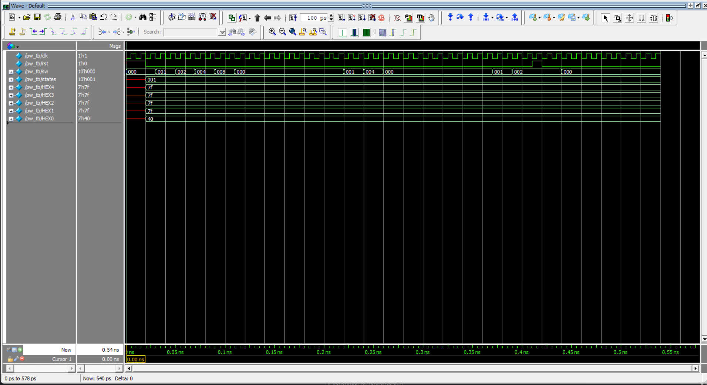
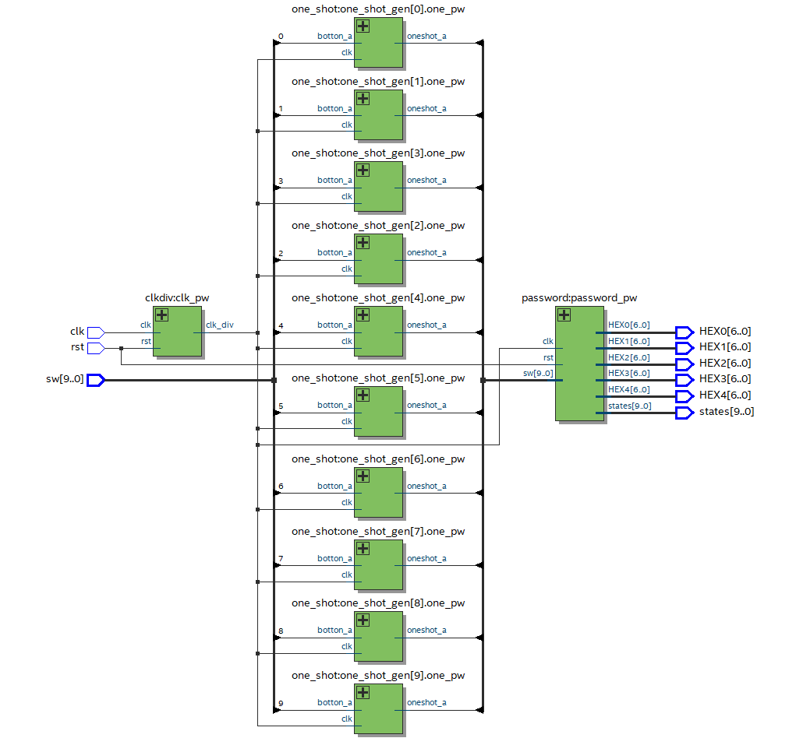
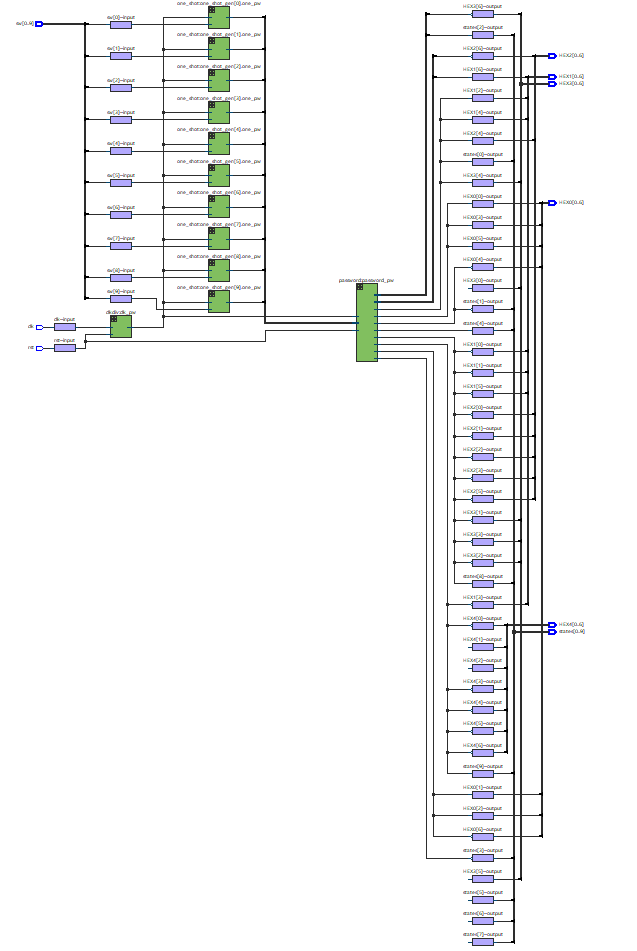
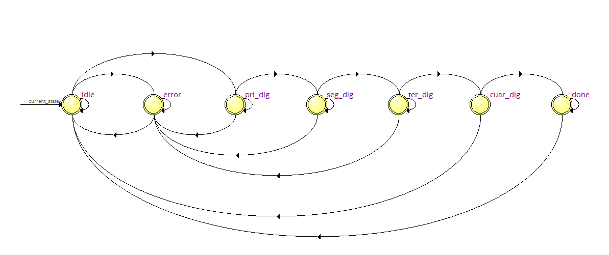

# Frecuenciometro en Verilog

## Información del Autor
- **Nombre:** Ana Maria Rodriguez Peña
- **Matrícula:** A01741831

## Descripción
Este proyecto implementa un sistema de verificación de contraseña en Verilog utilizando una máquina de estados finitos (FSM). El sistema permite al usuario ingresar una secuencia de dígitos a través de interruptores y verifica si la secuencia coincide con una contraseña predefinida. El diseño incluye un divisor de reloj para ajustar la velocidad de operación, un módulo de detección de flancos para eliminar ruido en las entradas, y una FSM para gestionar la lógica de verificación.

## Requisitos
*	Quartus Prime (Intel FPGA)
*	FPGA compatible (DE10-Lite, MAX10 10M50DAF484C7G)
*	Cable de programación JTAG

## Estructura del Proyecto
*	Entradas:
*     clk: Señal de reloj principal.
*     rst: Señal de reset para reiniciar el sistema.
*     sw: Interruptores de 10 bits que representan los dígitos ingresados por el usuario.
*   Salidas:
*     states: Señal de 10 bits que indica el estado actual del sistema.
*     HEX4, HEX3, HEX2, HEX1, HEX0: Señales de 7 segmentos para mostrar el estado o el resultado de la verificación.
*     password_out: Señal que indica si la contraseña es correcta (1) o incorrecta (0).
*   Módulos principales:
*     clkdiv: Divide la frecuencia del reloj para reducir la velocidad de operación.
*     one_shot: Detecta flancos de subida en los interruptores para generar pulsos limpios y evitar rebotes.
*     password: Implementa una máquina de estados finitos (FSM) para gestionar la lógica de verificación de la contraseña. Los estados incluyen idle, pri_dig, seg_dig, ter_dig, cuar_dig, done y error.
*   Proceso:
*     El sistema inicia en el estado idle y espera a que el usuario ingrese el primer dígito.
*     Si el dígito es correcto, el sistema avanza al siguiente estado (pri_dig, seg_dig, etc.).
*     Si la secuencia completa es correcta, el sistema pasa al estado done y activa la señal password_out.
*     Si se ingresa un dígito incorrecto, el sistema pasa al estado error.
*     El sistema puede reiniciarse en cualquier momento mediante la señal de reset (rst).

## Imágenes

## Video
[Ver video](ruta/al/password.mp4)
<video controls width="600">
  <source src="password.mp4" type="video/mp4">
  Tu navegador no soporta la reproducción de videos.
</video>
